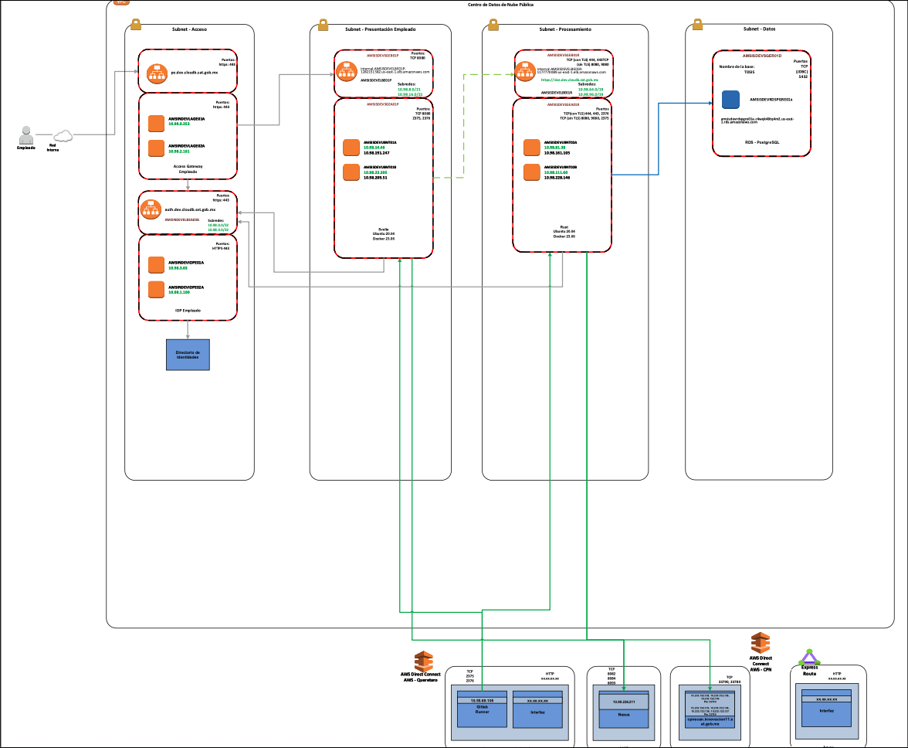
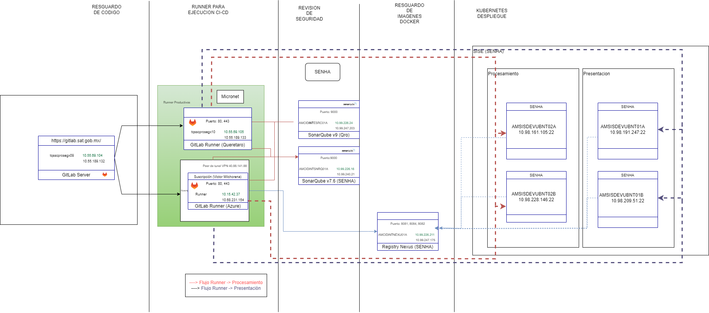
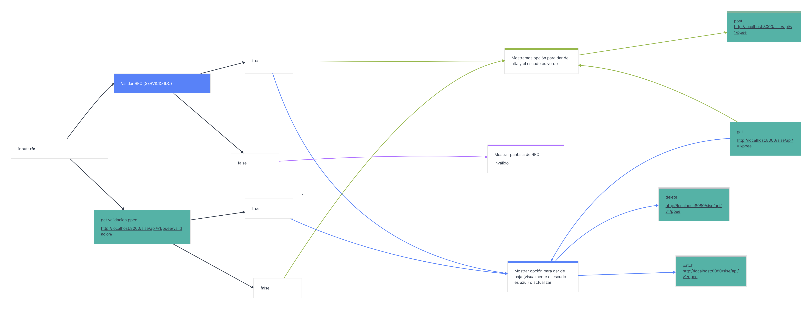
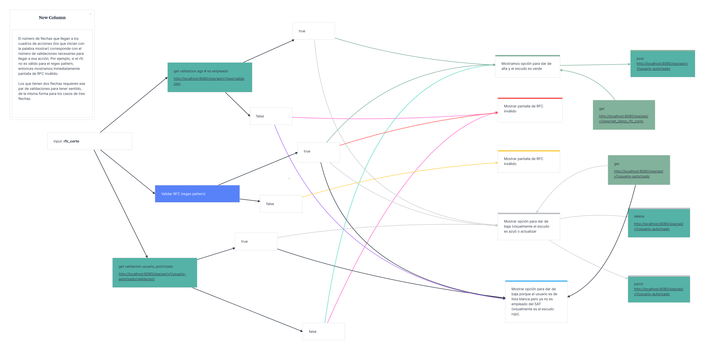
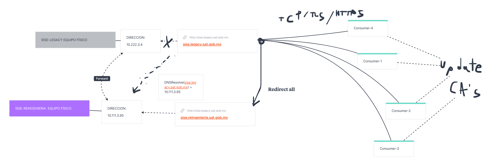

## Project name: Sistema de identidades y seguridad. (SISE)

## What?
My last project was about a dashboard and management of user's permissions re-engineered product. Our client was another department inside the government institution that had a legacy application and wanted to turn it into a web application.

## Why?
The external department required a solution to improve their productivity and to modernise and improve security standards, so that the confidentiality and integrity of the information were assured, as well as improve the UI and UX experience.

## How?
I led the technical development with other two developers and a designer. In the beginning we thought it would be straight forward, but it turned out that there were a lot of bureaucratic stoppers that we didn't consider at the beginning. We ended up focusing on finding the right teams that handled the required connections and focusing on testing the logic to assure that the business requirement result was correct for the new system. This increased the time from development to deployment by quite a bit, but it was solved even though we didn't have access to best practices like using DevOps for streamlining the development lifecycle. Personally it gave a lot of perspective into why is important to have a consolidated DevOps team, particularly as products mature and require much more maintenance (monitoring, metrics, logging, etc.)

Going down the technical rabbit hole, the architecture was a three layer solution: frontend, backend for frontend, and storage layer (structured database). The diagram below shows this layers as the right-side boxes, from left to right in order.

## Infrastructure and operations:

The user interacted indirectly via an institutional reverse-proxy (so that name-discovery were easier and to avoid the time to propagate DNS modifications- IP:domain-name changes). The was also an institutional identity provider service that our application integrated with to provide seamlessly log-in (authentication) capabilities to the application for the clients using their credentials, enhancing the UX experience. This integration was implemented based on the protocol OAuth2.0, authorization code flow to provide us with an access token a a refresh token. This security implementation was integrated for the dashboard sessions and roles management. In the diagram below, the reverse-proxy identity service provider is represented on the leftmost box.

Another required integration was for employment data. Given the lack of private APIs to easily consume that information from legacy database systems, we decided to consume it via a subscriber-publisher design pattern. They pushed a new actualization of their table view and we consume it on a weekly basis. That is represented with one of the green lines.

We also decided to streamline a CICD process for the whole system with the help of another team that was starting to implement CICD practices and had the required infrastructure. The codebase was stored in different gitlab repositories and runners and registries servers were used to implement the CICD streamline. SonarQube was used for linting (static coding analysis). Finally, we dockerized the applications and deployed the containers to the corresponding layers. From my side, the process involved network configurations, regular meetings with external cloud providers, troubleshooting, and resources management and configuring. As well as creating the **dockerfiles**, **docker-compose.yamls** and **gitlab-ci.yaml's**. 

## Product Development:
From the development perspective, it involved developing a web application consisting of different submodules (subsystems). The stack used was:

+ SvelteKit and typescript for the front-end UI/UX development.
+ ActixWeb and Rust for the Restful API and server development.
+ Starlette and python for the proxy service.

To get high-performance and stability we opted to use Rust as the language for developing two web services A and B. Service A was a Restful API that implemented business logic for the front-end and performed CRUD operations interacting with the database. Service B was also programmed using ActixWeb but it only involved answering POST requests that asked for information about a certain user and the service responded based on the information stored in the database about the user whether it was authorized or not to consult the required information.

For auditing (verification) reasons, we kept record of all the request ot system B, so that we stored employees information that wanted to consult information about users in the database. 

System A CRUD flows are described in the next two diagrams.

On the other hand, the python web service was used as a proxy to keep the legacy consumers systems supported. This is because the legacy systems consulted information using SOAP and XML requests. The python service provided conversion and passed down the converted request to json to the new system B.

As part of the information security actualizations, a new CA was generated and we used it to encrypt the communication between the different consumers and the service via TLS, that required resolving the domain-name of the DNS service to the new IP address of the re-engineered solution. The following diagram illustrate the idea.

Finally the front-end was implemented with the good practice of using both server and client side rendering. So that loading times and reduced and the overall user experience was great. We designed it using Figma and implemented the components using tailwindcss, SkeletonUI for styles and typescript with svelte for reactivity and state management.

## Learned lessons
+ It is important to have a strong DevOps team to support mature products! We ended up losing a lot of time because of bureocratic stoppers.
+ When configuring a service behind an access gateway, remember to setup correctly the routes behind the protected paths.
+ Don't generate test cases for uncertain features before the client decides that they will used them.
